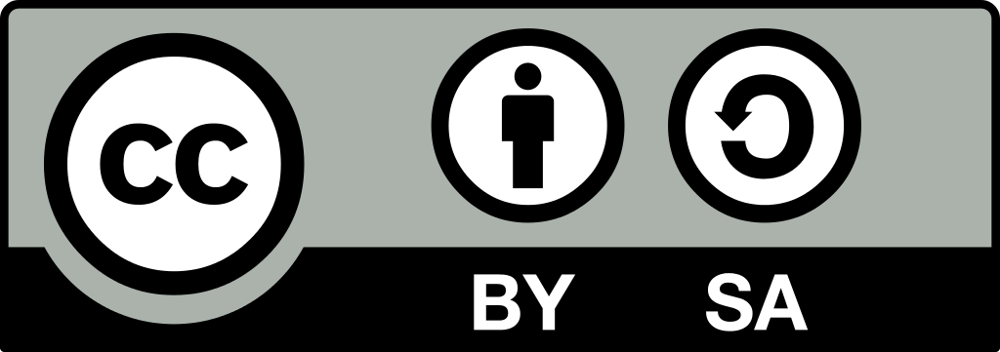

License 
============

TalkingMaps is provided under License  \ |STYLE0|\ 

\ |IMG1|\ 

.. _h21765566b6f451113b2b754c47262d:

    You are free to:
--------------------

* \ |STYLE1|\  — copy and redistribute the material in any medium or format

* \ |STYLE2|\  — remix, transform, and build upon the material for any purpose, even commercially.

.. _h513011937615c5775522e3e56363948:

    Under the following terms:
------------------------------

* \ |STYLE3|\  — You must give \ |LINK1|\ , provide a link to the license, and \ |LINK2|\ . You may do so in any reasonable manner, but not in any way that suggests the licensor endorses you or your use.

* \ |STYLE4|\  — If you remix, transform, or build upon the material, you must distribute your contributions under the \ |LINK3|\  as the original.

    \ |STYLE5|\  — You may not apply legal terms or technological measures that legally restrict others from doing anything the license permits.

    More info: \ |LINK4|\ 

.. bottom of content

.. |STYLE0| replace:: **CC BY-SA 4.0**

.. |STYLE1| replace:: **Share**

.. |STYLE2| replace:: **Adapt**

.. |STYLE3| replace:: **Attribution**

.. |STYLE4| replace:: **ShareAlike**

.. |STYLE5| replace:: **No additional restrictions**

.. |LINK1| raw:: html

    <a href="https://creativecommons.org/licenses/by-sa/4.0/#" target="_blank">appropriate credit</a>

.. |LINK2| raw:: html

    <a href="https://creativecommons.org/licenses/by-sa/4.0/#" target="_blank">indicate if changes were made</a>

.. |LINK3| raw:: html

    <a href="https://creativecommons.org/licenses/by-sa/4.0/#" target="_blank">same license</a>

.. |LINK4| raw:: html

    <a href="https://creativecommons.org/licenses/by-sa/4.0/" target="_blank">https://creativecommons.org/licenses/by-sa/4.0/</a>

