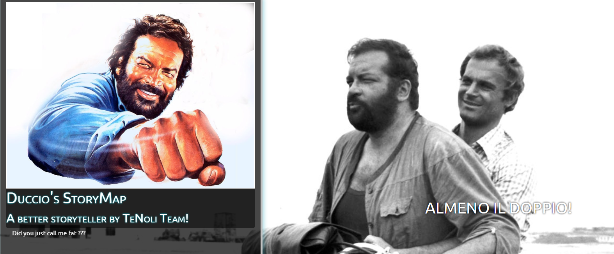

The Project
========

\ |IMG1|\ 

Why?
-----
	
we wanted to create an editor for storymaps that was easy to customize, easy to share and easily integrated with QGIS maps and other web resources.

Online DEMO
---------

It is possible to view the online demo at this link: https://tenz-development-tenz.c9users.io/talkingmaps/

"At vero eos et accusamus et iusto odio dignissimos ducimus qui blanditiis praesentium voluptatum deleniti atque corrupti quos dolores et quas molestias excepturi sint occaecati cupiditate non provident, similique sunt in culpa qui officia deserunt mollitia animi, id est laborum et dolorum fuga. Et harum quidem rerum facilis est et expedita distinctio. Nam libero tempore, cum soluta nobis est eligendi optio cumque nihil impedit quo minus id quod maxime placeat facere possimus, omnis voluptas assumenda est, omnis dolor repellendus. Temporibus autem quibusdam et aut officiis debitis aut rerum necessitatibus saepe eveniet ut et voluptates repudiandae sint et molestiae non recusandae. Itaque earum rerum hic tenetur a sapiente delectus, ut aut reiciendis voluptatibus maiores alias consequatur aut perferendis doloribus asperiores repellat."

..  Note:: 

    Duccio&BudSpencer

.. bottom of content

.. |IMG2| image:: static/index_2.png
   :height: 416 px
   :width: 601 px
