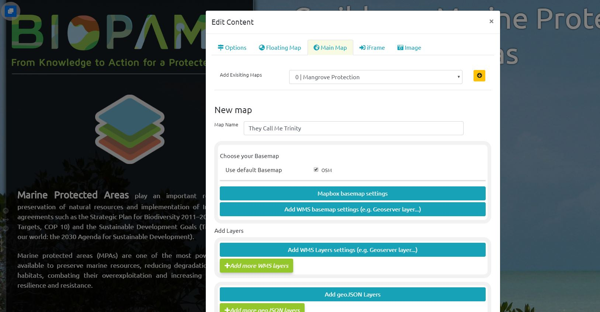
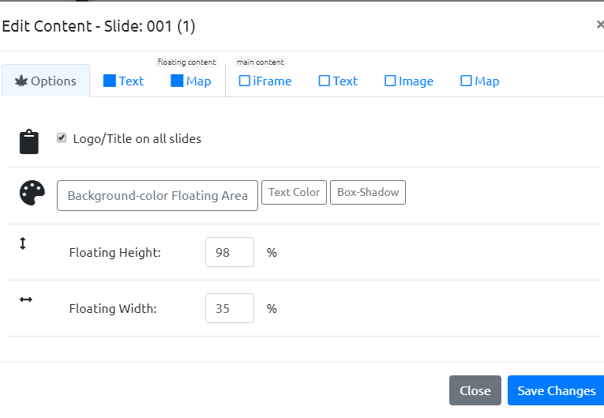
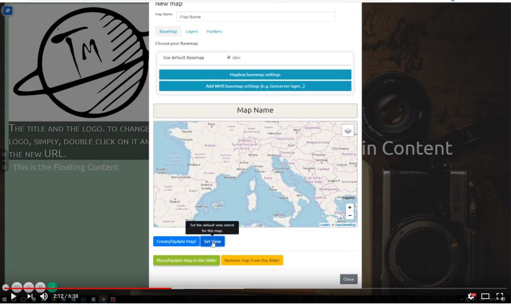

The Project
========

Do you want to tell a story with your maps, or are you simply looking for a new way to present your studies? TalkingMaps is the service that you need.

\ |IMG1|\ 

Why?
-----
We are the TenOli team (Martino & Federico), we love maps and web programming and we are OpenSource enthusiastic.
We wanted to create an editor for storymaps that was easy to customize, easy to share and easily integrated with QGIS maps and other web resources, and, obviously, totally Open Source. All this in order to be free to tell our stories whitout any limitations.

Quick Overview
--------------

\ |IMG3|\ 
https://www.youtube.com/embed/yVUNINAnIYI

Online DEMO
---------

It is possible to view the online demo at http://www.talkingmaps.eu

In order to create a new TalkingMap follow the instruction.

..  Note:: 

    The TalkingMap is still an alpha version, we are developing the platform. If you have any suggestion or do you want to help us, please contact us.  

.. bottom of content

