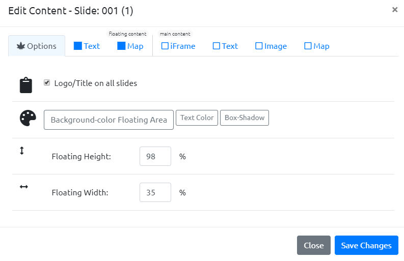
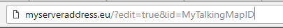

\ |STYLE0|\ 
========

First of all you need a story to tell. 

..  TIP:: 

    If your story develops in a clear and linear geospatial context it would be better

Once decided your story, you should give it a name (an ID). The ID is very important for TalkingMaps. Assigning an ID will make you able to export correctly the Talking Map.

If you are using our online editor, to add an ID you can simply enter the name in the form and press on Create! button.

\ |IMG1|\ 

..  Note:: 

    The TalkingMapID should follows the Snake_case convention: avoid spaces or special characters.

If you are not using our online editor, to assign an id you can just add, at the end of the address of your server:

\ |STYLE1|\    this command allow you to enter in the edit mode

\ |STYLE2|\   this command allow you to concatenate the commands and start editing a new TalkingMap.

\ |IMG2|\ 

The layout: Floating content and main content
-----

The main template is divided in two parts:

* Floating Content

* Main Content

The floating content is the left-side bar on your map. On the floating content you can add your personal logo, a title and a description for your TalkingMap and you can add images, and all

How to add and customize a new slide
-----
Edit slide content
-----
Floating content:
-----
 General options
-----
\ |IMG3|\ 

Text

Map

Main content

iframe

Text

Image

Map

.. bottom of content

.. |STYLE0| replace:: **How to create your first TalkingMap**

.. |STYLE1| replace:: *?edit=true*

.. |STYLE2| replace:: *&id=MyTalkingMapID*

.. |IMG3| image:: static/user_guide_3.png
   :height: 389 px
   :width: 601 px
